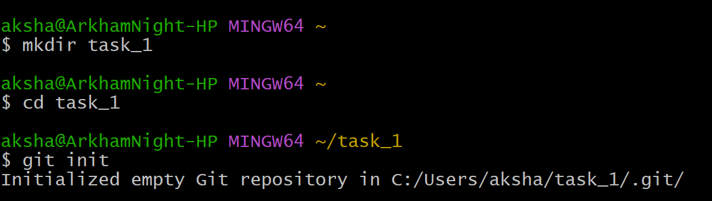
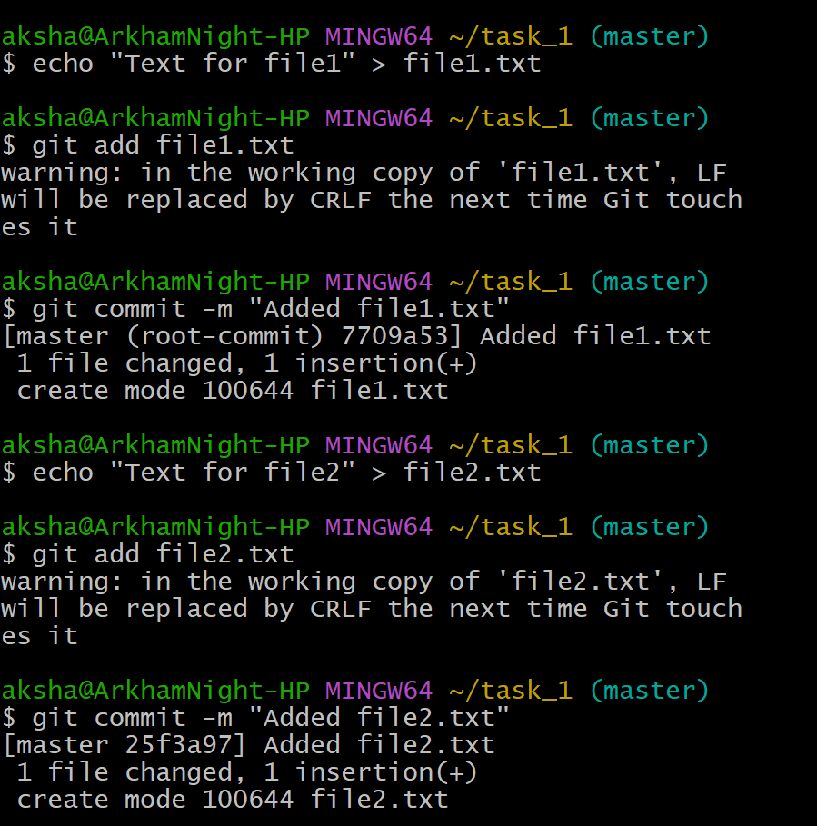
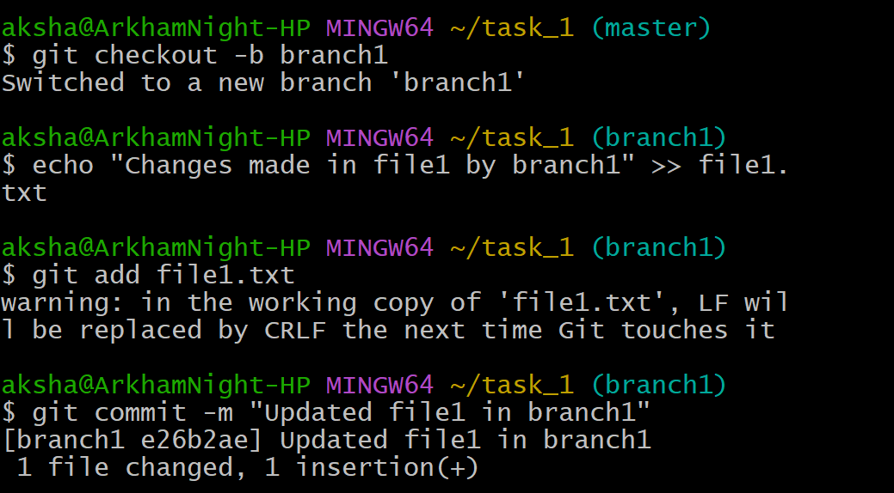
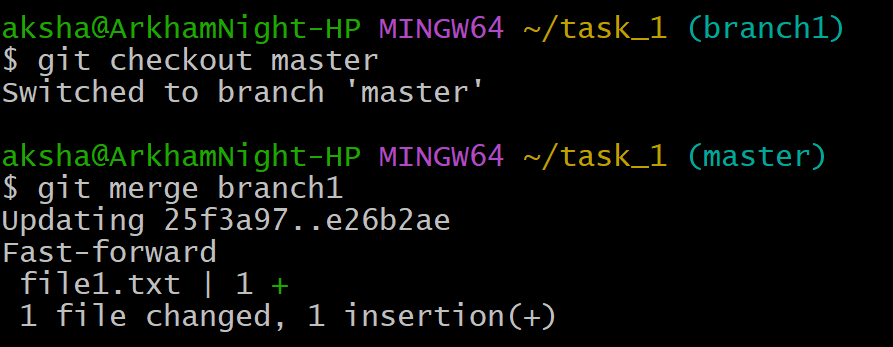
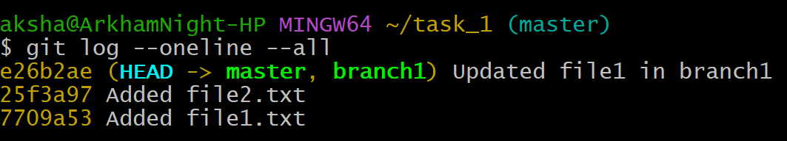

## Initialize, Commit, and Branch Basics

## Objective
To demonstrate basic Git operations by initializing a repository, creating and committing files, branching, making changes, merging branches, and viewing commit history.

## Commands

***mkdir task_1***  
***cd task_1***  
***git init***   
The “mkdir task_1” command creates a directory named task_1.  
The “cd task_1” command changes the directory to task_1.  
The “git init” is used to initialize a git repository.  

  

***echo "Text for file1" > file1.txt  
git add file1.txt***  
***git commit -m "Added file1.txt"  
echo "Text for file2" > file2.txt  
git add file2.txt  
git commit -m ""Added file2.txt***   
The “echo” command is used to create files file1.txt and file2.txt with some text. 
The "git add" command is used to add the file to the staging area.  
The "git commit" command is used to commit the file to the repository. 

  

***git checkout -b branch1***  
***git add file1.txt***  
***git commit -m "Updated file1 in branch1"***   
The "git checkout" command allows us to create and switch to a new branch - branch1.  
The “echo” command is used to change the contents of file1.txt.   
The “git add” and “git commit” commands are used to add and commit the changes in the new branch - branch1.  

  

***git checkout master***  
***git merge branch1***  
***git log --oneline --all***   
The "git checkout" is used to switch back to the master branch.  
The “git merge” command is used to merge branch1 into master. 

  

***git log --oneline --all***
The “git log” command is used to see the commit history in the current branch. 
-- oneline : shows each commit on a single line.  
--all : displays commit history on all branches.  

