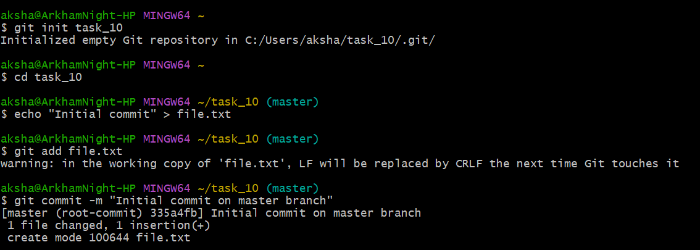
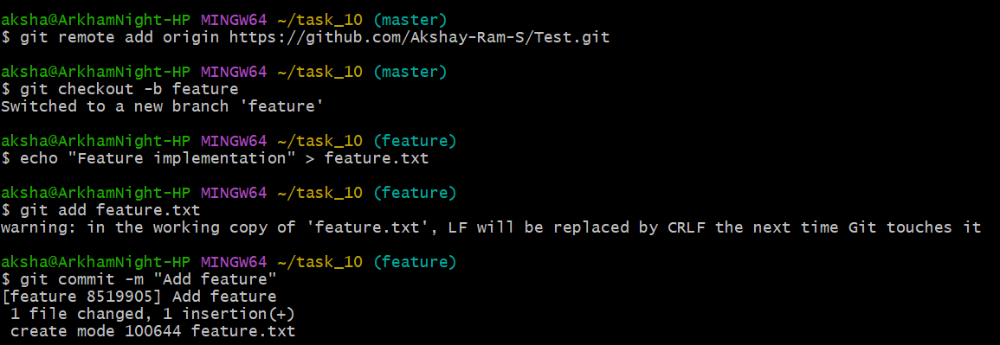
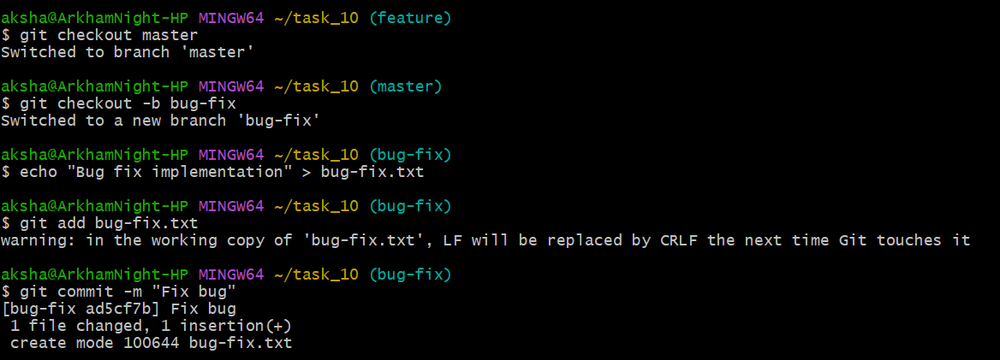
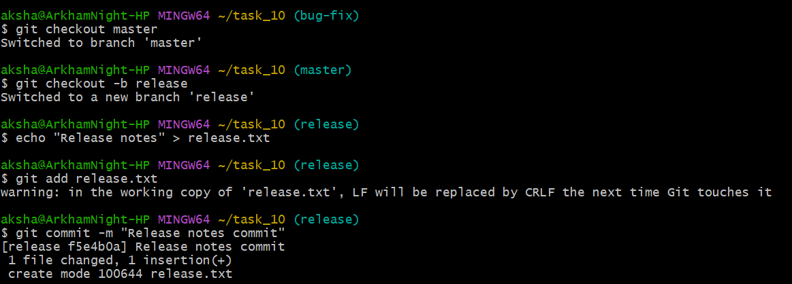
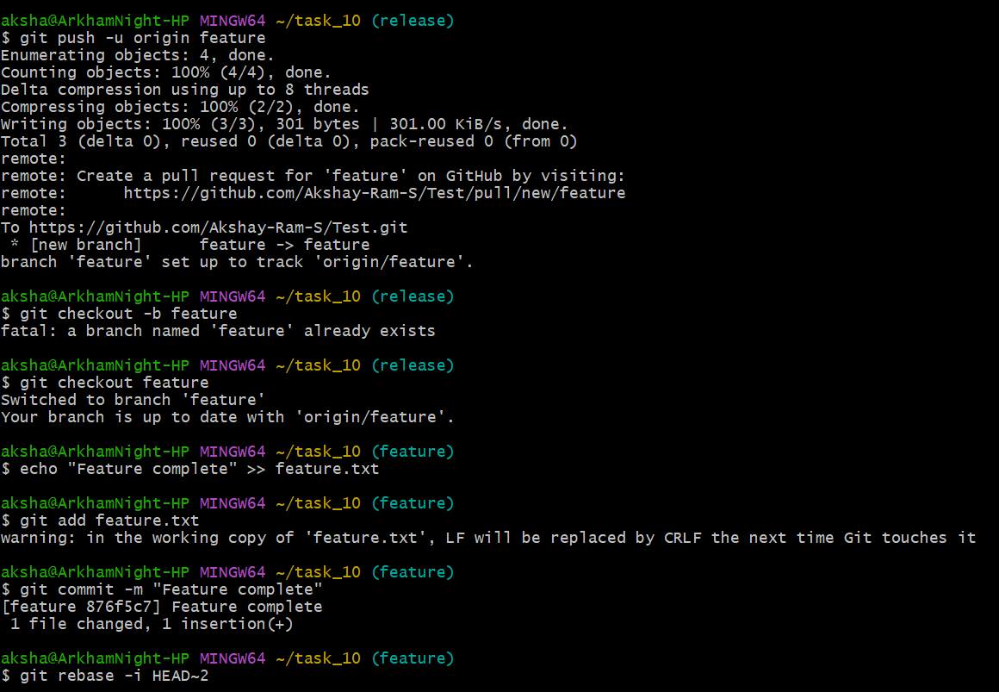
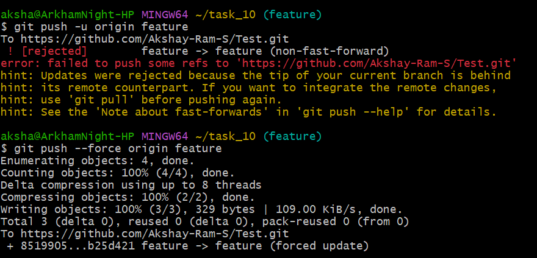
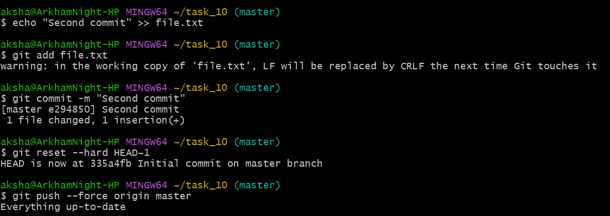
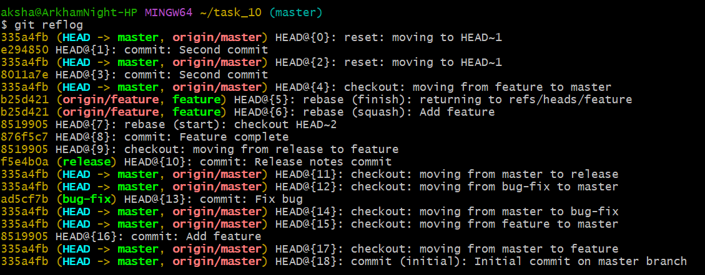
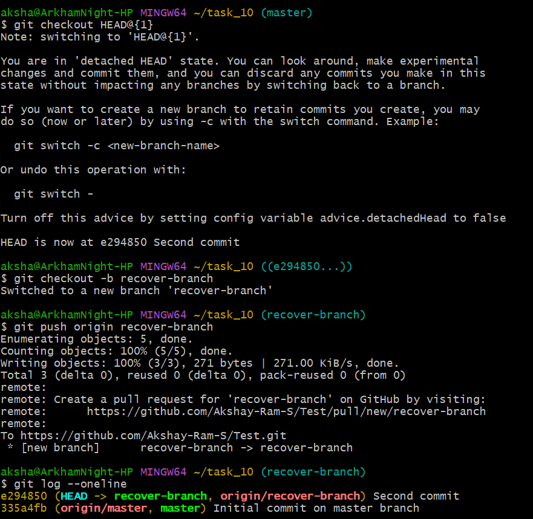

## Comprehensive Workflow with Forced Pushes and Recovery

## Objective

To simulate an advanced Git scenario that includes forced pushes, recovering lost commits, and a multi-branch workflow.

## Commands

```bash
git init task_10 
cd task_10 
echo "Initial commit" > file.txt 
git add file.txt 
git commit -m "Initial commit on master branch"
```
Initialized a repository, added file.txt and made on commit on it. <br>


<br><br>

```bash
git remote add origin https://github.com/Akshay-Ram-S/Test.git 
git checkout -b feature 
echo "Feature implementation" > feature.txt
git add feature.txt 
git commit -m "Add feature"
```
Add the origin and give the github link to store repository. <br>
Created "feature" branch, added feature.txt and made commit. <br>


<br><br>

```bash
git checkout master 
git checkout -b bug-fix 
echo "Bug fix implementation" > bug-fix.txt 
git add bug-fix.txt 
git commit -m "Fix bug"
```
Created "bug-fix" branch, added bug-fix.txt and made commit. <br>


<br><br>

```bash
git checkout master 
git checkout -b release
echo "Release notes" > release.txt
git add release.txt 
git commit -m "Release notes commit"
```
Created "release" branch, added release.txt and made commit. <br>


<br><br>

```bash
git push -u origin feature 
git checkout feature 
echo "Feature complete" >> feature.txt 
git add feature.txt 
git commit -m "Feature complete" 
git rebase -i HEAD~2
```
Switched to feature branch, made changes in feature.txt and made commit. <br>


<br><br>

The rebase opens and we change the second commit as "squash" to combine both commits. <br>


<br><br>

**Forced Push :** <br>

```bash
git push -u origin feature 
git push --force origin feature
```
Since we’ve rewritten history, Git will not allow a regular push and will instead require a forced push as we can see below. <br>
The --force option for git push allows you to override this rule: the commit history on the remote will be forcefully overwritten with your own local history. <br>


<br><br>

**Simulate a mistake and recover lost commit :** <br>

```bash
git checkout master
echo "Second commit" >> file.txt 
git add file.txt 
git commit -m "Second commit" 
git reset --hard HEAD~1 
git push --force origin master
```
We make a commit again so that now we have two commits. The "git reset --hard HEAD~1" command is used to revert back one commit. The last commit is gone, and the history has been rewritten and pushed. <br>
The force push is a dangerous operation, as any changes that others may have made are now lost and rewritten


<br><br>

```bash
git reflog
``` 
The reflog is a powerful tool for maintaining a safety net in your Git repository and recovering from various accidental or unexpected changes, such as those times when you need to recover lost commits or branches and have lost track of your Git history. <br>


<br><br>

```bash
git checkout HEAD@{1} 
git checkout -b recover-branch
git push origin recover-branch 
git log --oneline
```
The "git checkout HEAD@{1}" is used to recover the commit we want. <br>
Create a new branch with the recover commit and push it to the repository. <br>
The "git log" command is used to verify the commits. <br>


<br><br>

***Best practices for collaborating with teams when rewriting history and using force pushes***

1. Force pushes should only be used when absolutely necessary. <br>
2. Always inform your team when performing a force push. <br>
3. The --force-with-lease option is a safer alternative to --force, as it ensures that you can only force push if your local branch is up-to-date with the remote branch. <br>
4. If you absolutely need to perform a force push, it’s a good idea to create a backup branch first, just in case something goes wrong. 


