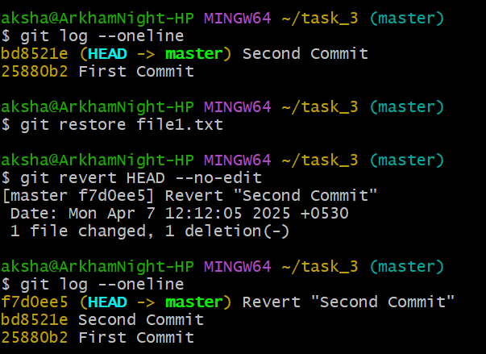
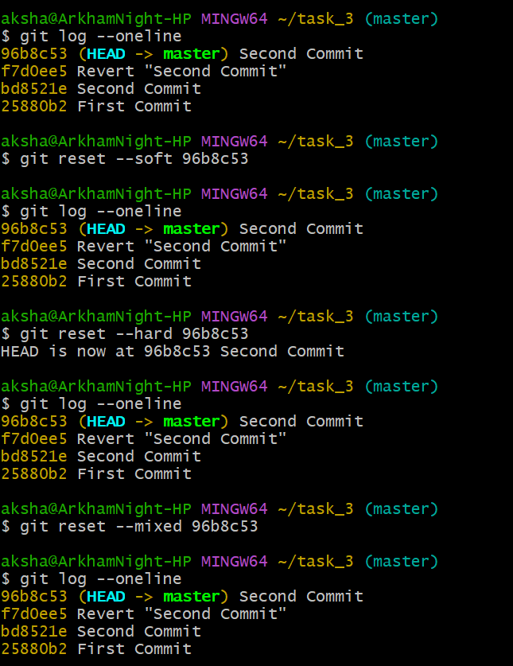

## Undoing Changes and Reverting Commits

## Objective

To experiment with undoing changes in our working directory and commits.

## Commands

***git log --oneline***  
***git restore file1.txt***  
***git revert head --no-edit***  
***git log --oneline***   
The “git restore” command will discard the new changes, reverting file1.txt to the last committed state.  
The “git revert” command is used to create a new commit that undoes the changes from the "Second Commit" and --no-edit means no message is included.  
The “git log” command is used to see the past commits for comparison.  

  

***git log --oneline  
git reset --soft 96b8c53  
git log --oneline  
git reset --hard 96b8c53  
git log --oneline  
git reset --mixed 96b8c53***   
The “git reset” command is used to reset when we want to move the repository back to a previous commit, discarding any changes made after that commit. 
soft reset - moves HEAD back, but the changes remain staged.  
hard reset - completely removes the commit and its changes from the working directory and history.  
mixed reset - moves HEAD back, unstages the changes, but keeps them in your working directory.  

  

  ***git checkout*** vs ***git restore***  
**git checkout** - Originally used for switching branches and checking out commits. Over time, it’s also been used to discard changes in files.  
**git restore** - Designed specifically to restore files to their last committed state, making it more intuitive for undoing changes.   

***git revert vs git reset***  
**git revert** - Creates a new commit that undoes the changes introduced by a previous commit. The commit history remains, which is crucial for shared/public branches.  
**git reset** - Moves the HEAD pointer to a different commit, effectively removing commits from the history (hard or mixed resets). It can affect both the commit history and your working directory depending on the mode used.  

