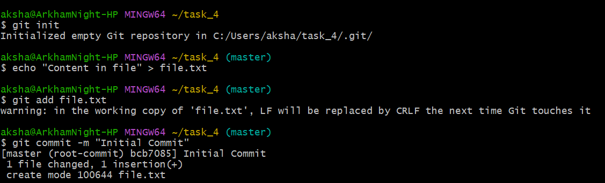
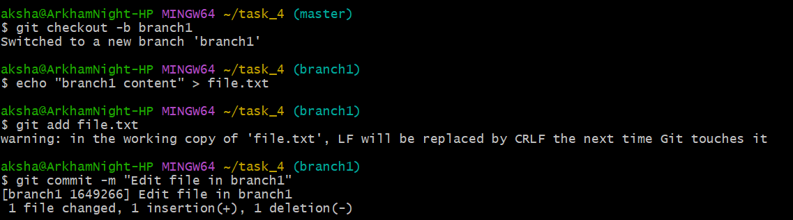
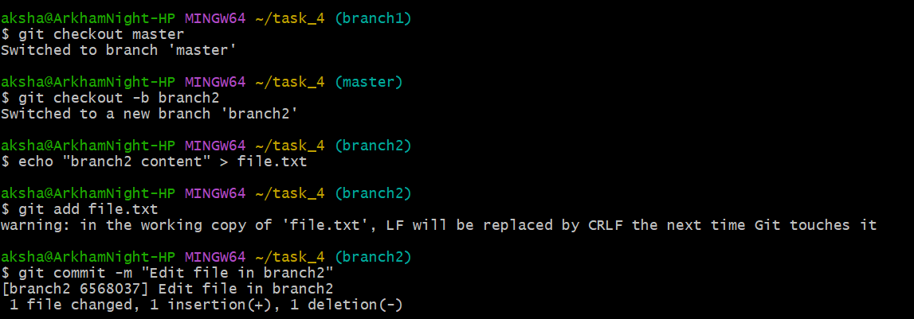
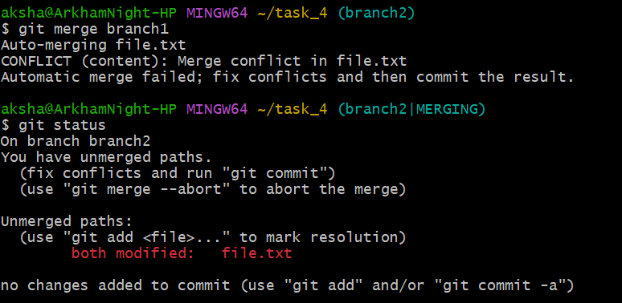
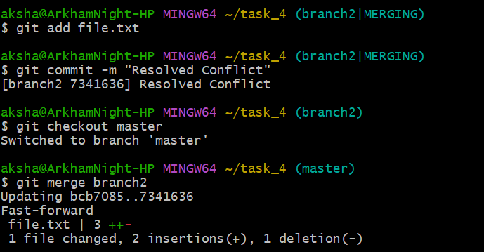

## Simulating and Resolving Merge Conflicts

## Objective

To create a scenario that produces a merge conflict and resolve it.

## Commands

```bash
git init
echo "Content in file" > file.txt 
git add file.txt 
git commit -m "Initial Commit"
```
The initial commits are made in the master branch.<br>


<br><br>

```bash
git checkout -b branch1 
echo "branch1 content" > file.txt
git add file.txt 
git commit -m "Edit file in branch1"
```

We create branch1 and commit the above changes in file.txt. <br>


<br><br>

```bash
git checkout master
git checkout -b branch2
echo "branch2 content" > file.txt
git add file.txt
git commit -m "Edit file in branch2"
```
We create branch2 and commit the same changes we did in branch1. <br>


<br><br>

```bash
git merge branch1 <br>
git status
```
When we merge branch1 into branch2, we get the above CONFLICT : Merge conflict in file.txt. <br> 
We use the “git status” command to display the state of the staging area.<br>
We manually go to the file.txt and change it manually however we would like it to be. <br>


<br><br>

```bash
git add file.txt 
git commit -m "Resolved Conflict" 
git checkout master 
git merge branch2*** 
```
After changing the file manually, we commit the file on branch2. Then, we move to the master branch and merge branch2. <br>


