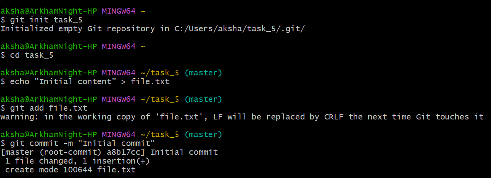
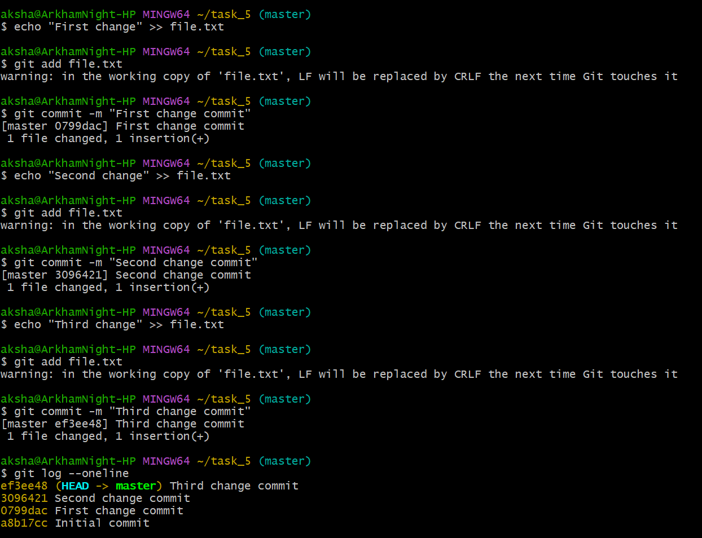
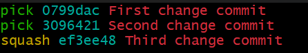
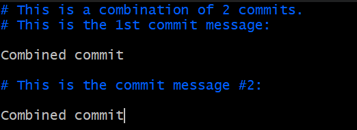
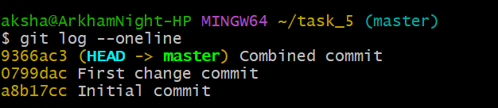

## Interactive Rebasing for Clean Commit History

## Objective

To use interactive rebase to tidy up your commit history.

## Commands

***git init task_5  
cd task_5  
echo "Initial content" > file.txt  
git add file.txt  
git commit -m "Initial commit"***  

We initialize a repository, add a text file and commit it.  

  

***echo "First change" >> file.txt  
git add file.txt  
git commit -m "First change commit"  
echo "Second change" >> file.txt  
git add file.txt  
git commit -m "Second change commit"  
echo "Third change" >> file.txt  
git add file.txt  
git commit -m "Third change commit"  
git log --oneline***  

A series of commits are made.

  

***git rebase -i HEAD~3***  
The above command opens up previous 3 commits in the editor.  

 

We are using “squash” to combine the lastt commit with the immediate previous commit.  
The following are the commands available:  
p, pick = use commit  
r, reword = use commit, but edit the commit message  
e, edit = use commit, but stop for amending  
s, squash = use commit, but meld into previous commit  
f, fixup = like "squash", but discard this commit's log message  
x, exec = run command (the rest of the line) using shell  
d, drop = remove commit  

After changing the desired commands, we will save and exit the editor and another editor will be opened as shown below.  
Here we can edit the commit messages if required. After editing/confirming, save the editor and close it. It will redirect you to the git bash terminal.  

  

***git log --oneline***  
Since we used the squash command, the "Third change commit" and "Second change commit" are converted into one single commit as "Combined commit".  

  

**Squashing**  

Squashing helps by combining multiple commits into a single, coherent commit before merging into the main branch.  
When working on a feature branch, you often make multiple commits to implement a feature and fix bugs.  
These changes might be sometimes very minor and need not be listed as separate commits. We can combine all these minor commits into one major commit.  

*Advantages*  
1. Cleaner and readable commit history  
2. Easier code reviews

