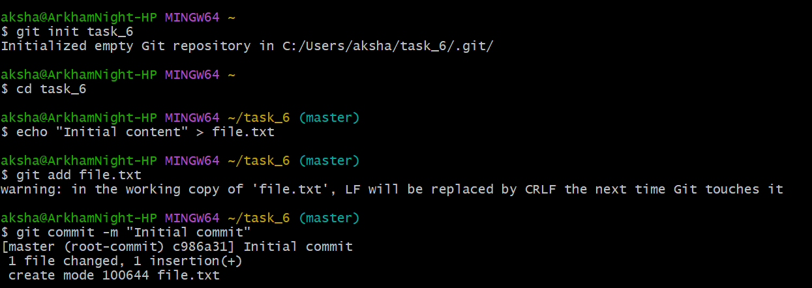
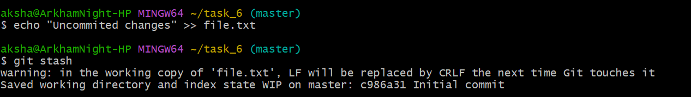
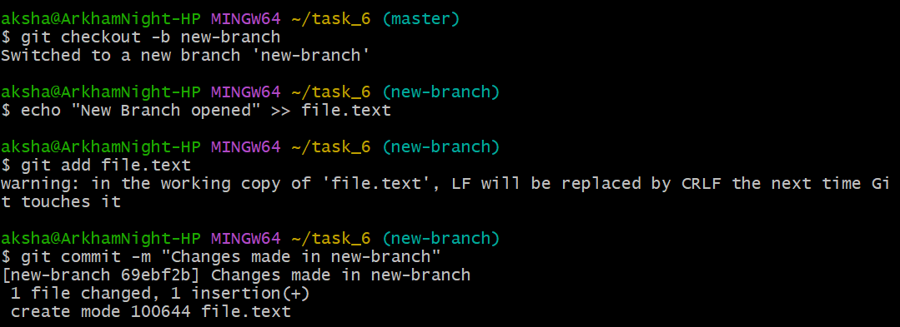
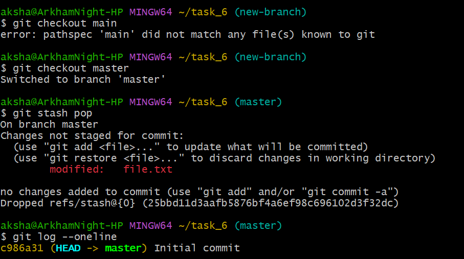
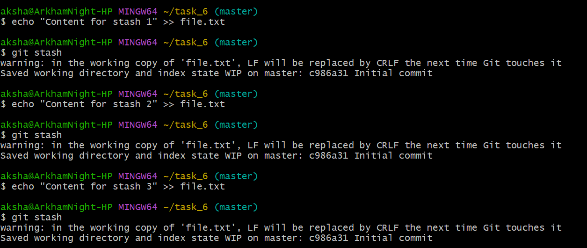
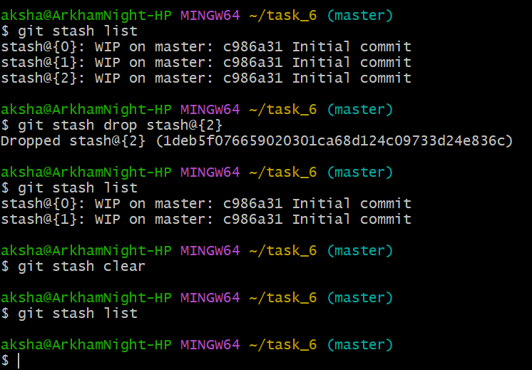

## Stashing Changes for Context Switching

## Objective
To learn how to use Git stash to save uncommitted work temporarily.

## Commands

***git init task_6  
cd task_6  
echo "Initial content" > file.txt  
git add file.txt  
git commit -m "Initial commit"***   

Initial commit is made after initializing and adding file.txt.  

  

***echo "Uncommitted changes" > file.txt  
git stash***  

The above command will stash the changes in your working directory and revert the file to last committed state.  

  

***git checkout -b new-branch  
echo "New branch opened" >> file.txt  
git add file.txt  
git commit -m "Changes made in new branch"***   
A new branch is created and some changes are made in file.txt and committed.  

  

***git checkout master  
git stash pop  
git log --oneline***  

The branch is switched back to the master branch.  
The "git stash pop" command applies the stashed changes back to the working directory and removes the stash from the stash list.  

  

***echo "Content for stash 1" >> file.txt  
git stash  
echo "Content for stash 1" >> file.txt  
git stash  
echo "Content for stash 1" >> file.txt  
git stash***  

Creating a list of stash.  

  

***git stash list  
git stash drop stash@{2}  
git stash list  
git stash clear  
git stash list***  

The "git stash list" is used list all the saved stashes.  
The "git stash drop" is used to delete a specific stash from the stash list.  
The "git stash clear" is used to reomve all stashes in the list.  

