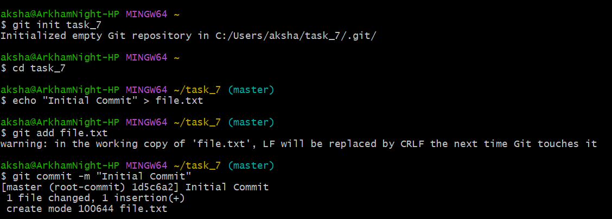
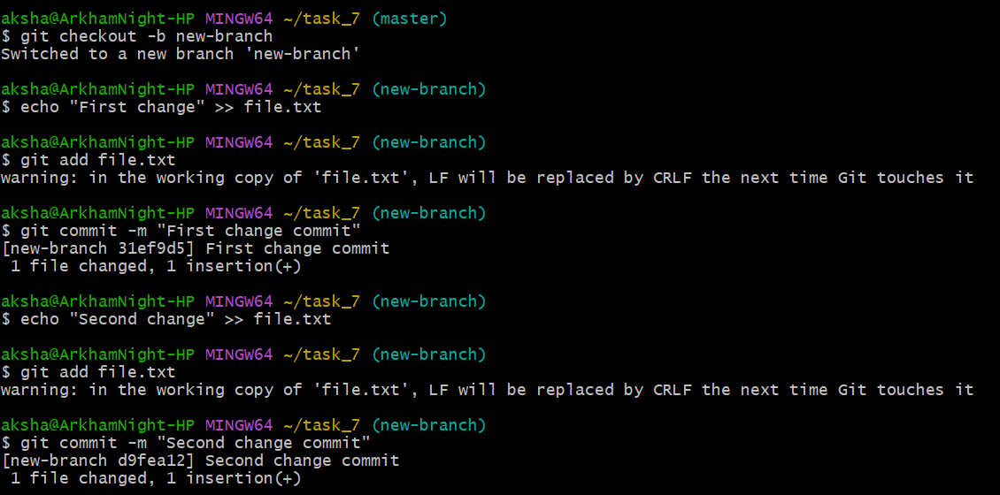
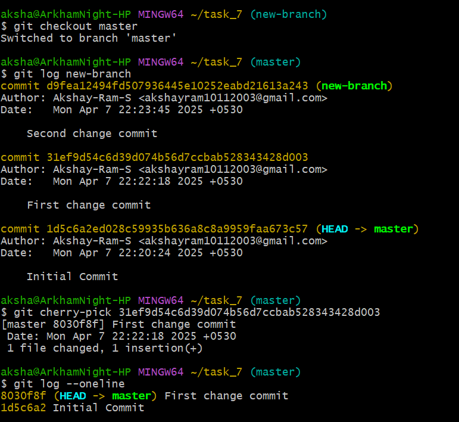

## Cherry-Picking Commits Between Branches

## Objective

To selectively apply a commit from one branch to another using cherry-pick.

## Commands

```bash
git init task_7
cd task_7 
echo "Initial Commit" > file.txt
git add file.txt
git commit -m "Initial Commit"
```
Initialization of repository and initial commit is made.


<br><br>

```bash
git checkout -b new-branch 
echo "First change" >> file.txt 
git add file.txt 
git commit -m "First change commit" 
echo "Second change" >> file.txt 
git add file.txt
git commit -m "Second change commit"
```
Two different commits are made in new-branch. <br>


<br><br>

```bash
git checkout master 
git log new-branch 
git cherry-pick 31ef9d54c6d39d074b56d7ccbab528343428d003 
git log --oneline
```
The "git cherry-pick" command is used to apply the changes introduced by a specific commit from one branch onto another. <br>
We can see the cherry-picked commit in the history of the main branch. <br>


