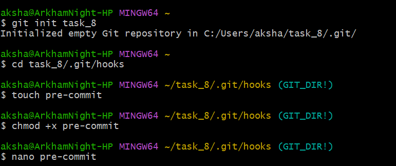
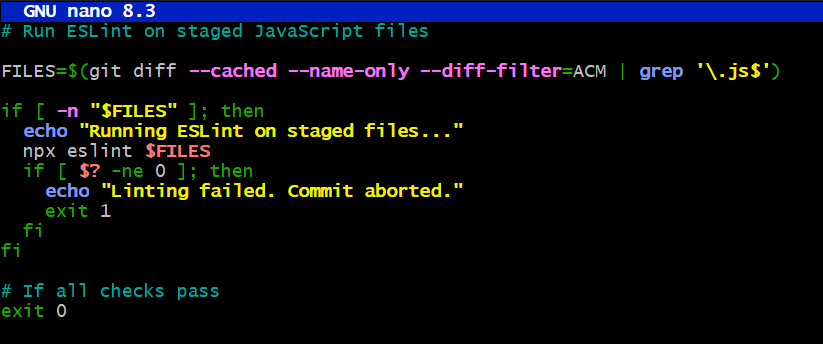
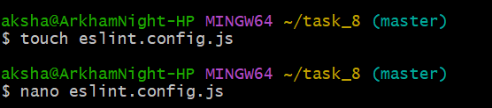
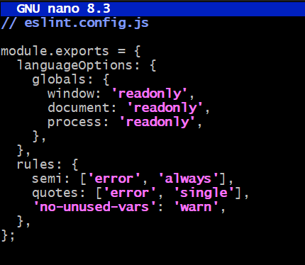
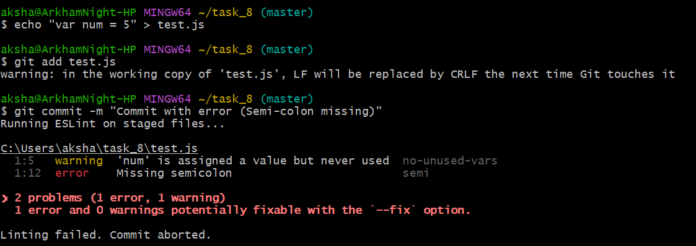
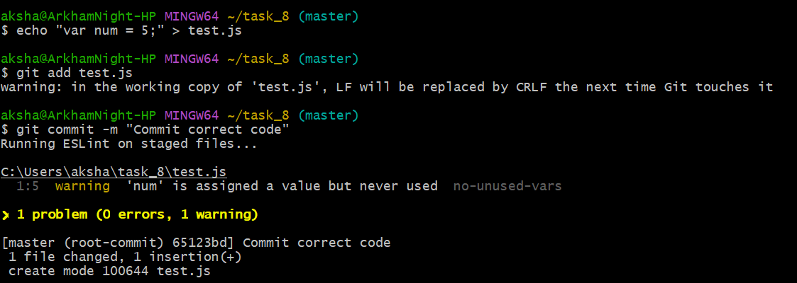

## Using Git Hooks for Automated Checks

## Objective

To set up a Git hook to run scripts (like linters) before commits are finalized.

## Commands

***git init task_8  
cd task_8/.git/hooks  
touch pre-commit  
chmod +x pre-commit  
nano pre-commit***  

Go to the hooks directory inside .git directory and create a pre-commit file.  
The command "chmod +x pre-commit" command is used to change the file permissions to allow execution.  
The pre-commit file is opened in nano editor.  

  

The pre-commit file is written as shown below in nano editor.  

  

***touch eslint.config.js  
nano eslint.config***  

  

We configure the eslint.config.js file to define rules and language options.  

  

***echo "var num = 5" > test.js  
git add test.js  
git commit -m "Commit with error (Semi-colon missing)"***  

We save test.js with "var num = 5" with a semi-colon missing and we are adding the file to the stage area and committing it.  
Since there is error in code, commit will fail as we gave in pre-commit.  

  

***echo "var num = 5;" > test.js  
git add test.js  
git commit -m "Commit correct code"***  

We are giving the semi-colon and try again to add and commit.  
Since there are no errors, the commit is successful.  

  
