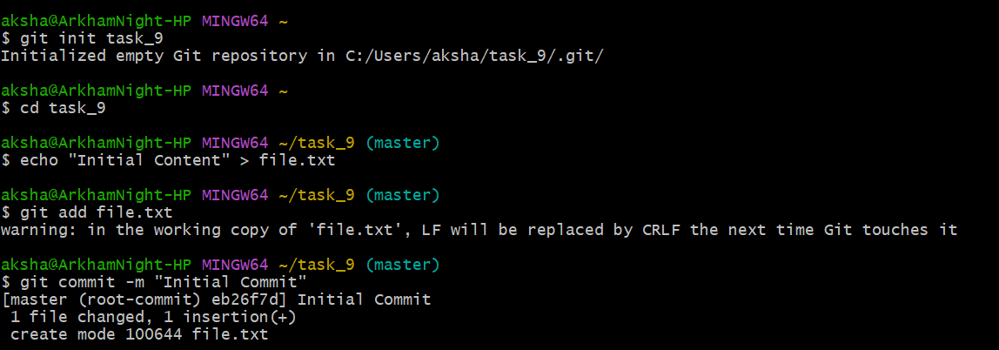
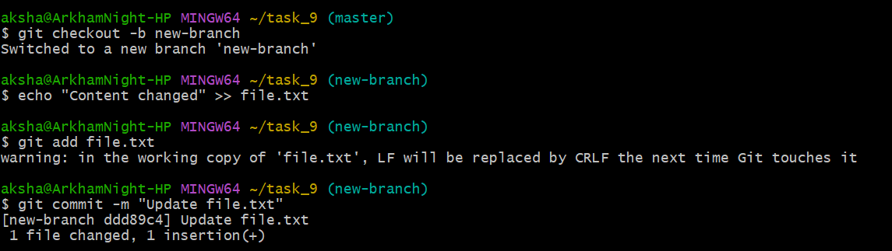
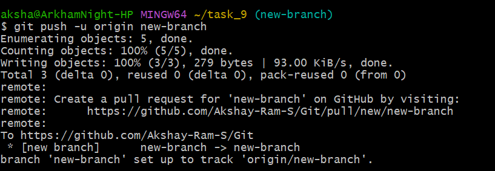
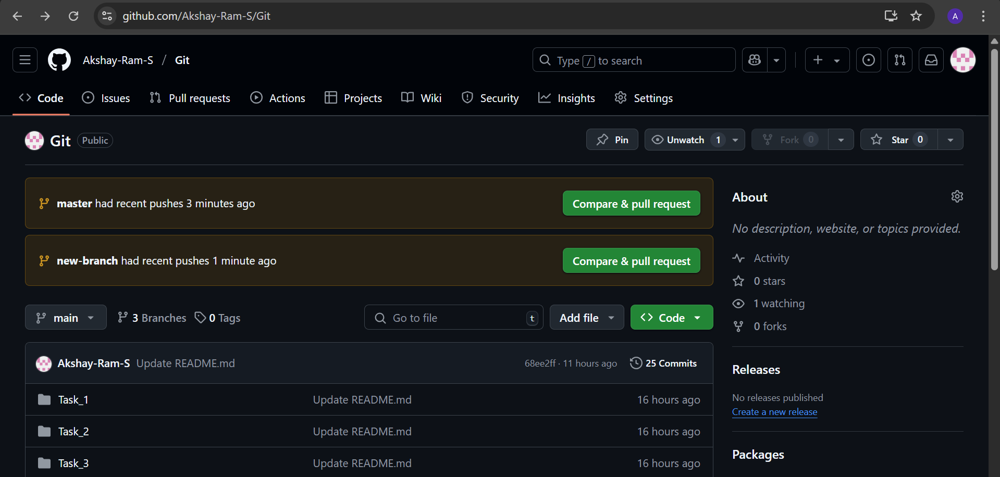
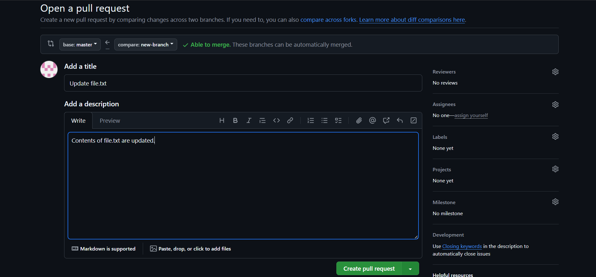
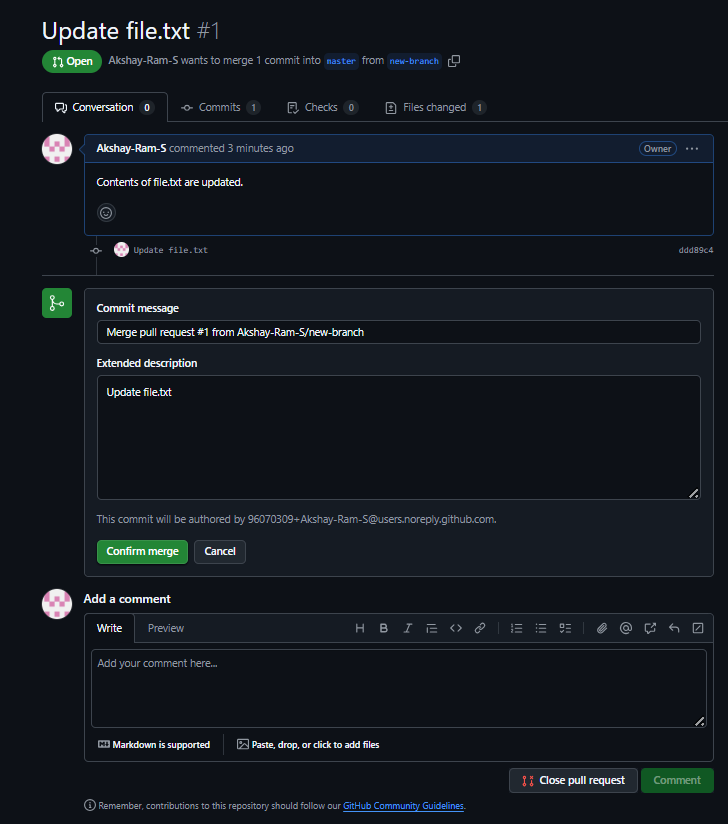
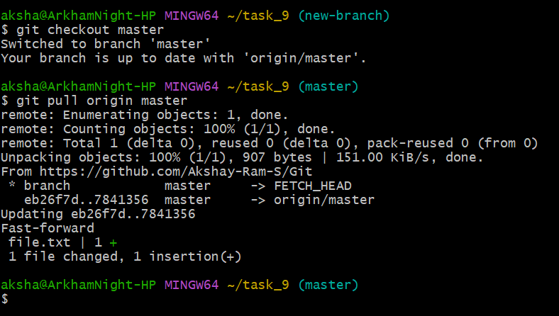

## Working with Remote Repositories and Collaboration

## Objective
To simulate a collaborative workflow with remote repositories.

## Commands

***git init task_9  
cd task_9  
echo "Initial Content" > file.txt  
git add file.txt  
git commit -m "Initial Commit"***  

Initial commit is made after initializing repository.  

  

***git remote add origin https://github.com/Akshay-Ram-S/Git  
git push -u origin master***  

We add the url of the repository to link it remotely and we push the initial commit to it.  

  

***git checkout -b new-branch  
echo "Content changed" >> file.txt  
git add file.txt  
git commit -m "Update file.txt"***  

We create new branch and modify the file content and commit it.  

  

***git push -u origin new-branch***  

We push the new-branch to git.  

  

We open github and see the pull requests and click on comapre and pull request.  

  

Then we create a pull request in github.  

  

The code review process is carried out. Reviewers can comment on code changes and approve the PR.  

  

***git checkout master  
git pull origin master***  

The above commands are used to pull the merged changes locally.  

